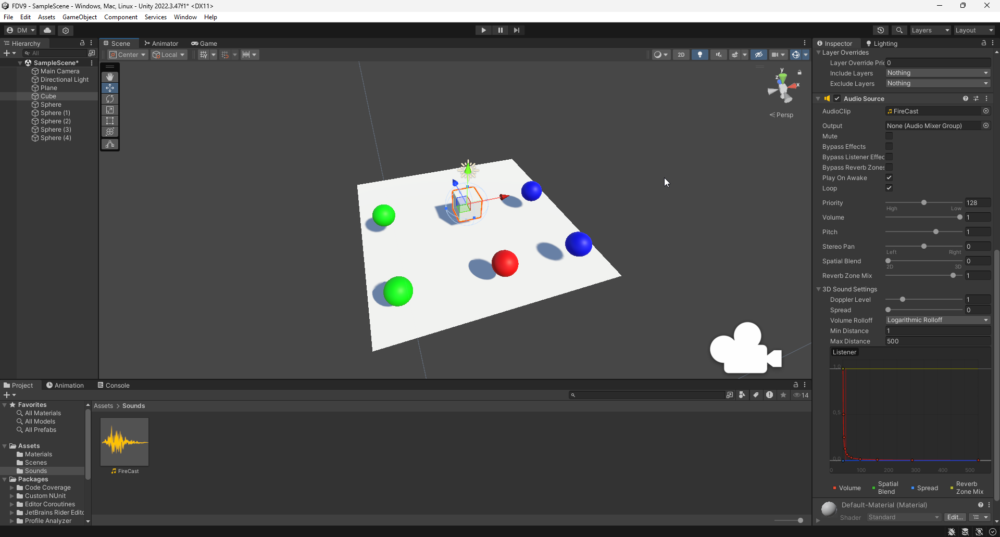
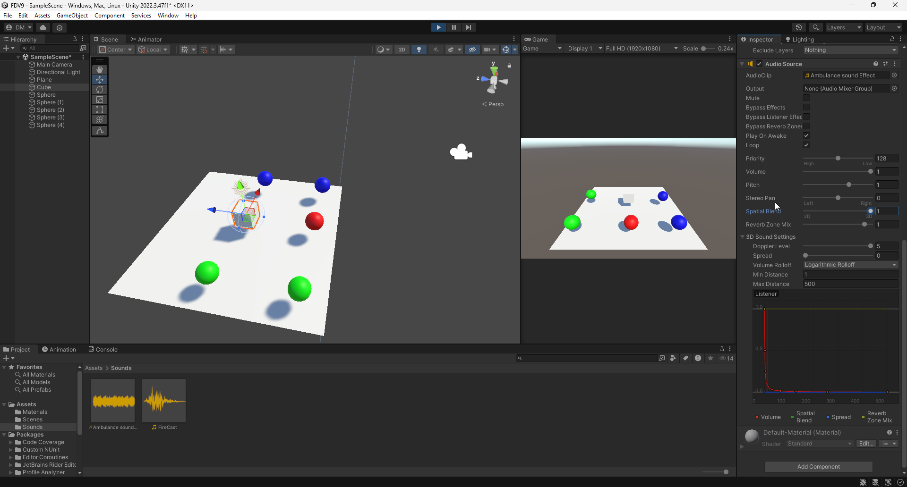
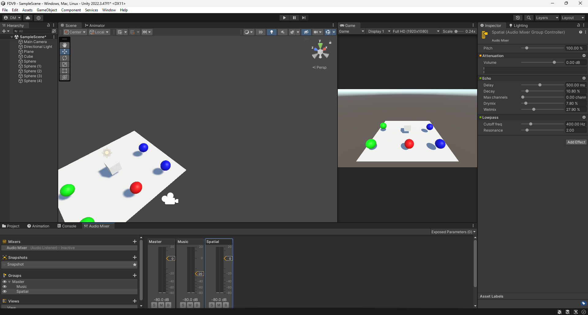
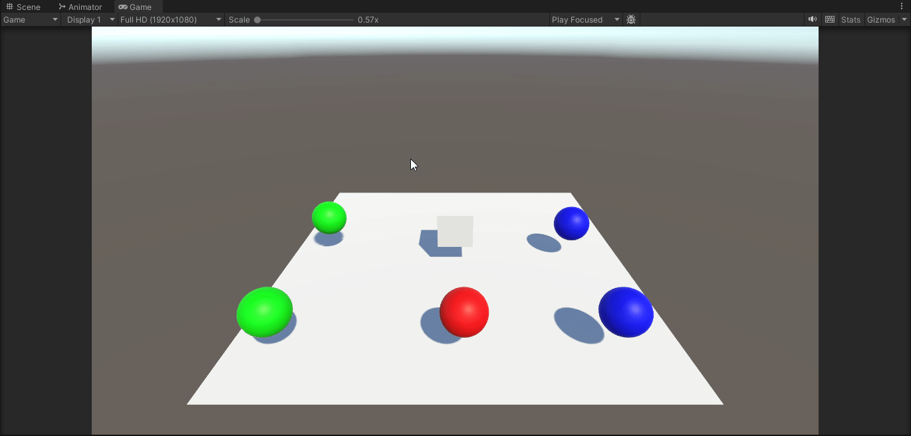
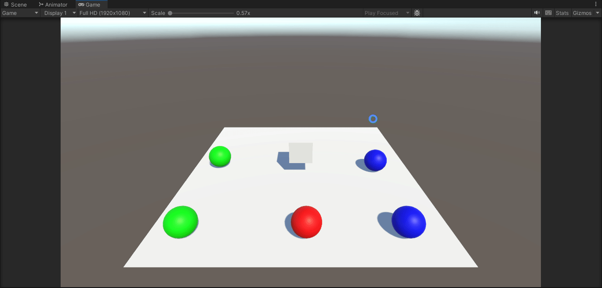

# Fundamentos del desarrollo de videojuegos
### Diego Herrera Mendoza
Sonido

1. Configurar una escena simple en 3D con un objeto cubo que hará de player y varias esferas de color. Agregar un objeto AudioSource desde el menú GameObject → Audio 
Seleccionar un clip de audio en algún paquete de la Asset Store de tu gusto y adjuntarlo a una esfera. El audio se debe reproducir en cuanto se carga la escena y en bucle.

2. En la escena anterior crea un objeto con una fuente de audio a la que le configures el efecto Doppler elevado y que se mueva a al pulsar la tecla m a una velocidad alta. Explica los efectos que produce:
    
    - Incrementar el valor del parámetro Spread
    
        Este parámetro determina como se va a distribuir el audio en los canales stereo Tiene 3 puntos clave: 0, en donde el sonido es muy direccional. 180, en el que el sonido se combina en ambos canales. Y 360, en el que el sonido es direccional pero se posiciona al lado contrario del que proviene.

    - Cambiar la configuración de Min Distance y Max Distance

        Estos parámetros establecen como se percibe el sonido en función de la distancia al oyente. La distancia mínima determina cual es la distancia en donde se encuentra el punto más alto de volumen. Mientras que la distancia máxima determina el punto en el que el volumen se atenua por completo.

    - Cambiar la curva de Logarithmic Rollof a Linear Rollof

        Teniendo en cuenta lo dicho anteriormente, es la curva que sigue el volumen dependiendo de la distancia del oyente. Esta puede ser una curva lineal o logarítmica.

3. Configurar un mezclador de sonidos, aplica a uno de los grupo un filtro de echo y el resto de filtros libre. Configura cada grupo y masteriza el efecto final de los sonidos que estás mezclando. Explica los cambios que has logrado con tu mezclador.

4. Implementar un script que al pulsar la tecla p accione el movimiento de una esfera en la escena y reproduzca un sonido en bucle hasta que se pulse la tecla s.

Script: [SphereSound](scripts/SphereSound.cs)

5. Implementar un script en el que el cubo-player al colisionar con las esferas active un sonido.

Script: [Cube](scripts/Cube.cs)

6. Modificar el script anterior para que según la velocidad a la que se impacte, el cubo lance un sonido más fuerte o más débil.

Script: [Cube](scripts/Cube.cs)

7. Agregar un sonido de fondo a la escena que se esté reproduciendo continuamente desde que esta se carga. Usar un mezclador para los sonidos.

Esta tarea se completa más tarde en el ejercicio 9

8. Crear un script para simular el sonido que hace el cubo-player cuando está movimiento en contacto con el suelo (mecánica para reproducir sonidos de pasos).

Script: [Footsteps](scripts/FootSteps.cs)

9. En la escena de tus ejercicios 2D incorpora efectos de sonido ajustados a los siguientes requisitos:
Crea un grupo SFX en el AudioMixer para eventos:
- Movimiento del personaje: Crea sonidos específicos para saltos y aterrizajes.
- Interacción y recolección de objetos: Diseña sonido para la recolección de objetos.
- Indicadores de salud/vida: Diseña un sonido breve y distintivo para cada cambio en el estado de salud (por ejemplo, ganar o perder vida).
Crea un grupo Ambiente:
- Crea un sonido de fondo acorde con el ambiente
- Agrega una zona específica del juego en que el ambiente cambie de sonido
Crea un grupo para música: Crea un loop de música de fondo acorde al tono del juego

Scripts: [PlayerMovement](scripts/PlayerMovement.cs), [Collectable](scripts/Collectable.cs), [OnAmbientChange](scripts/OnAmbientChange.cs), [HealthBar](scripts/HealthBar.cs)

